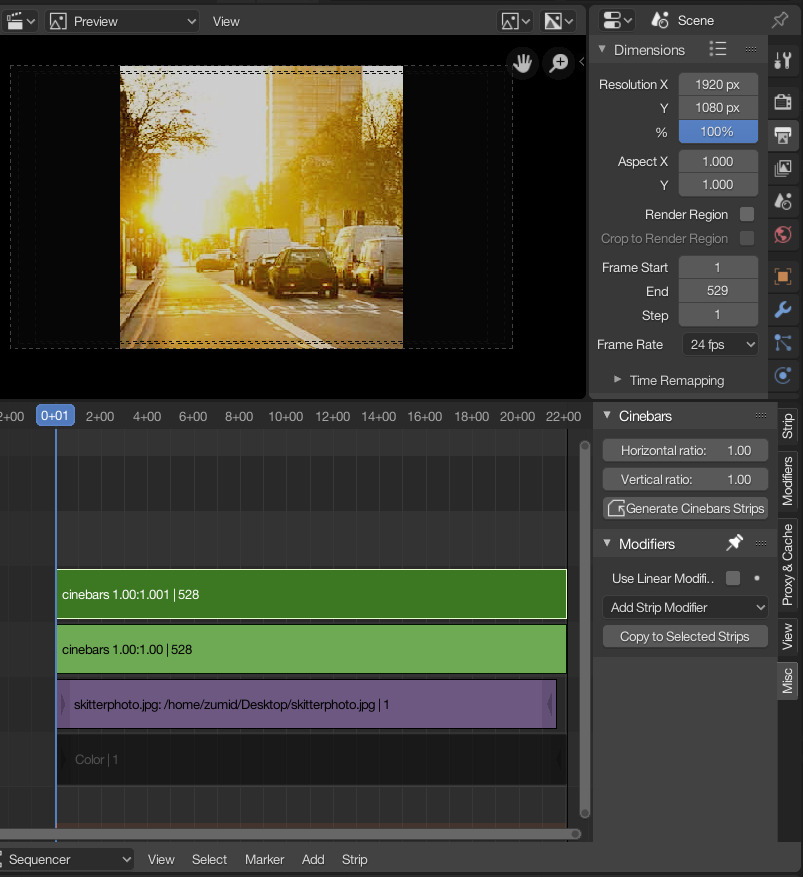

# Cinebars
This add-on provides a drawer in the properties pane of Blender's Video Sequence Editor, that lets you add a letterboxing effect ("cinematic bars") to the project. Also useful for preview cropping in various aspect ratios. Please note - while many people may desire this effect, it is somewhat discouraged in favor of using *actual* video resolutions respective of a target aspect ratio.

Besides simply adding "cinematic bars", another use case would be to quickly make a starting point to animate them, giving the impression of changing aspect ratios
(useful for filmmakers desiring a specific focus on a character, or as a storytelling device)

Unlike the [Letterbox](http://wiki.blender.org/index.php/Extensions:2.6/Py/Scripts/Sequencer/Letterbox) add-on, it does not scale the video at all. Rather, it adds black bars to the sides of the video (top & bottom or left & right) to "crop" the video to a specified aspect ratio.

## 2.7x Users
This add-on has been updated for Blender 2.8. For 2.79 users, please check the `blender2.7` tag.

## Usage
The "Cinebars" drawer can be easily found in the Misc tab of the Video Sequencer. Simply plug in your desired aspect ratio and click "Generate Cinebars Strip". It will generate 3 strips which you can then move to the top of your timeline: A base color strip, and two transform strips which resizes and overlays the color strips on top
of the footage.

Ex: to generate 2.35:1 (CinemaScope) bars:
* Enter `2.35` in the Horizontal Ratio slider
* Enter `1` in the Vertical Ratio slider
* Click on "Generate Cinebars strips".

## Preview

